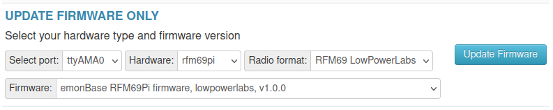

# emonBase with RFM69Pi (ATmega328)

Version 3 of the RFM69Pi was released in 2015 and sold as part of the emonBase package until end of 2022. This product has now been replaced with the RFM69-SPI board. We do have a limited stock of the original v3 RFM69Pi board for applications that require backwards compatibility.

## Using an RFM69Pi v3 with the emonTx4

If you are looking to use the new emonTx4 energy monitoring node with an existing emonBase with the RFM69Pi v3 adapter board there are a couple of options:

1\. Use the backwards compatible JeeLib Classic radio format on the emonTx4 unit. This can be selected when buying an emonTx4 form the shop.

2\. Update the firmware on the on the RFM69Pi v3 board to the LowPowerLabs compatible emonBase_rfm69pi_LPL firmware using the firmware update tool on the emonBase. Navigate to Admin > Update > Update Firmware Only. Select hardware: rfm69pi, Radio format: RFM69 LowPowerLabs.

## Firmware

- [emonBase_rfm69pi_LPL](https://github.com/openenergymonitor/emonBase_rfm69pi_LPL): RFM69 LowPowerLabs format radio firmware.
- [emonBase_rfm69n](https://github.com/openenergymonitor/emonBase_rfm69n): Native RFM69 radio firmware.
- [RFM69CW_RF12_Demo_ATmega328](https://github.com/openenergymonitor/RFM2Pi/tree/master/firmware/RFM69CW_RF_Demo_ATmega328/RFM69CW_RF12_Demo_ATmega328): JeeLib Classic radio format firmware.

## Hardware

- [v3.1 schematic and board files](https://github.com/openenergymonitor/RFM2Pi/tree/master/hardware/RFM69Pi_V3.1)
- [v3 wiki page](https://wiki.openenergymonitor.org/index.php?title=RFM69Pi_V3)
